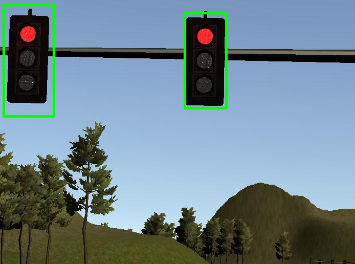

This is the project repo for the final project of the Udacity Self-Driving Car Nanodegree: Programming a Real Self-Driving Car. For more information about the project, see the project introduction [here](https://classroom.udacity.com/nanodegrees/nd013/parts/6047fe34-d93c-4f50-8336-b70ef10cb4b2/modules/e1a23b06-329a-4684-a717-ad476f0d8dff/lessons/462c933d-9f24-42d3-8bdc-a08a5fc866e4/concepts/5ab4b122-83e6-436d-850f-9f4d26627fd9).


This project was developed by:
* Stephany Berrio (Team Lead)  chinitaberrio@gmail.com
* Hirata Atsunori hirata.a@mazda.co.jp
* Bhavin Patel bhavinpatel420@gmail.com
* Siddharth Kataria katariasiddharth94@gmail.com
* Fereshteh Firouzi fereshteh.firouzi90@gmail.com

### 


Please use **one** of the two installation options, either native **or** docker installation.

### Native Installation

* Be sure that your workstation is running Ubuntu 16.04 Xenial Xerus or Ubuntu 14.04 Trusty Tahir. [Ubuntu downloads can be found here](https://www.ubuntu.com/download/desktop).

* Follow these instructions to install ROS
  * [ROS Kinetic](http://wiki.ros.org/kinetic/Installation/Ubuntu) if you have Ubuntu 16.04.
  * [ROS Indigo](http://wiki.ros.org/indigo/Installation/Ubuntu) if you have Ubuntu 14.04.
* Download the [Udacity Simulator](https://github.com/udacity/CarND-Capstone/releases).

### Port Forwarding
To set up port forwarding, please refer to the "uWebSocketIO Starter Guide" found in the classroom (see Extended Kalman Filter Project lesson).

### Usage

1. Clone the project repository
```bash
https://github.com/chinitaberrio/Capstone_SDC_nanodegree.git
```

2. Install python dependencies
```bash
cd CarND-Capstone
pip install -r requirements.txt
```
3. Make and run styx
```bash
cd ros
catkin_make
source devel/setup.sh
roslaunch launch/styx.launch
```
4. Run the simulator


### Other library/driver information
Outside of `requirements.txt`, here is information on other driver/library versions used in the simulator and Carla:

Specific to these libraries, the simulator grader and Carla use the following:

|        | Simulator | Carla  |
| :-----------: |:-------------:| :-----:|
| Nvidia driver | 384.130 | 384.130 |
| CUDA | 8.0.61 | 8.0.61 |
| cuDNN | 6.0.21 | 6.0.21 |
| TensorRT | N/A | N/A |
| OpenCV | 3.2.0-dev | 2.4.8 |
| OpenMP | N/A | N/A |

We are working on a fix to line up the OpenCV versions between the two.


### Detector
For this project we adopted the approach shown in [TrafficLight_Detection-TensorFlowAPI](https://github.com/vatsl/TrafficLight_Detection-TensorFlowAPI) . 




